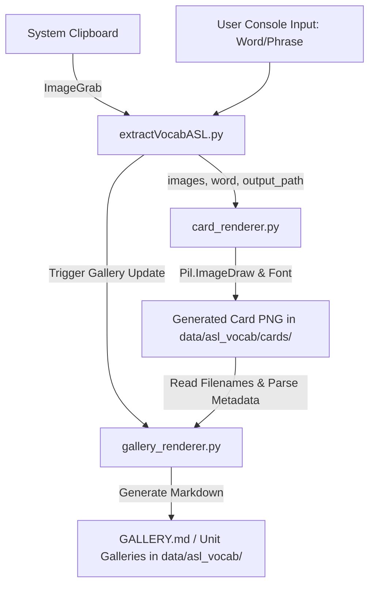

# ASL Vocabulary Ingestion Tool (Standalone)

This is a standalone tool extracted from the `L-Mnemo2` project. It is designed to capture screenshots of sign language from the clipboard, construct flashcard images (by layouts), and automatically update Markdown galleries representing vocabulary sheets.

## Rationale & Goal
Managing vocabulary flashcards manually is slow and error-prone. This tool automates the creation of cards with 1 to 6 images, automatically scaling and drawing the word on the card, and dynamically maintaining visual galleries that can be viewed directly in markdown viewers (like GitHub or Obsidian).

## Main Features
- **Flexible Image Layouts**: Supports layouts for 1, 2, 3, 4, 5, or 6 images on a single card.
- **Clipboard Integration**: Grabs screenshots directly from the clipboard (`Shift-Control-Command-4` on macOS).
- **Auto-slugification**: Creates filenames automatically based on unit number, word/phrase slug, and timestamp.
- **Dynamic Gallery Generation**: Automatically generates and updates index galleries and unit-specific galleries.

## Data Flow
Here is how data flows through the application:



## Setup & How to Run
Prerequisites: `uv` (Fast Python Package Installer and Manager) and Python 3.13+.

1. Run `uv sync` to create the virtual environment and install dependencies (namely `Pillow` for image editing).
   ```bash
   uv sync
   ```
2. Calibrate Screen Coordinates:
   Before running the tool, you need to calibrate the bounding box coordinates of your video player/signing region in Chrome. Run the calibration command:
   ```bash
   extractVocabASL --calibrate
   # or locally:
   uv run python extractVocabASL.py --calibrate
   ```
   - When launched, you will see a 3-second countdown.
   - **Immediately switch focus to Chrome** and make sure the video player is visible.
   - Once the dimmed screen capture overlay opens, click and drag a red selection rectangle over the video player region, then release. The coordinates will be saved.

3. Run Ingestion (Globally or Locally):
   Since the wrapper script is in your `PATH` (under `~/.local/bin/`), you can invoke the tool directly from any directory:
   ```bash
   extractVocabASL
   # or locally:
   uv run python extractVocabASL.py
   ```
   - Enter the number of images you want to use (1-6, default: 2).
   - Switch to Chrome and scrub your video.
   - Press **`F8`** globally (while inside Chrome) to capture the calibrated region for each image. (A system beep sound will play upon each capture).
   - Once the target number of screenshots is reached, a draft card image will automatically open in **Preview.app** for review, and a macOS dialog will pop up asking for the vocabulary word.
   - Type the word and press `Enter` to finalize the card (or click Cancel to discard).

4. Refresh galleries:
   To regenerate galleries from existing cards without taking new screenshots:
   ```bash
   extractVocabASL --refresh-gallery
   ```

## Roadmap Features
- **Alternative Clipboard Formats**: Support non-image data formats or drag-and-drop.
- **Cloud Backup**: Automatically upload generated card images to cloud storage.
- **SQLite Metadata Integration**: Enable database storage of card-to-word mappings for custom learning apps.
