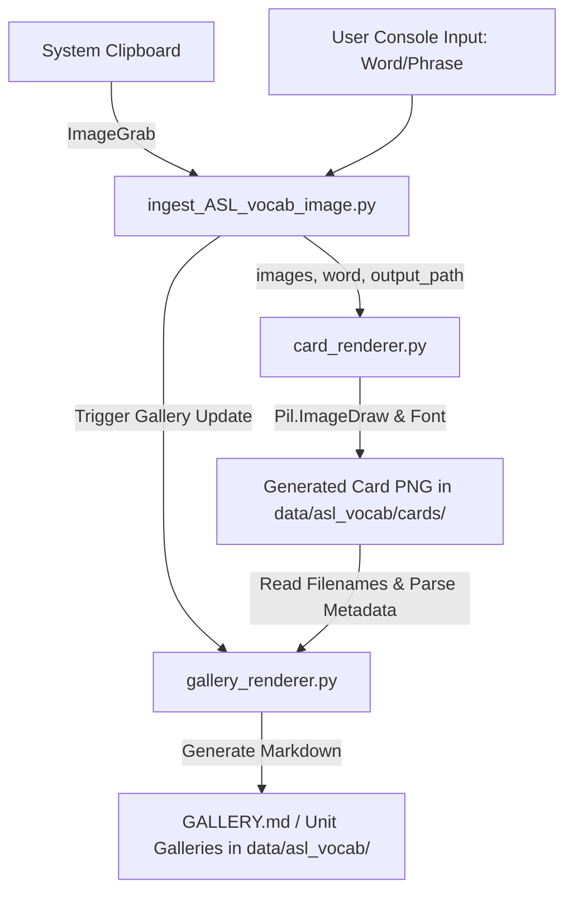

# ASL Vocabulary Ingestion Tool (Standalone)

This is a standalone tool extracted from the `L-Mnemo2` project. It is designed to capture screenshots of sign language from the clipboard, construct flashcard images (by layouts), and automatically update Markdown galleries representing vocabulary sheets.

## Rationale & Goal
Managing vocabulary flashcards manually is slow and error-prone. This tool automates the creation of cards with 1 to 4 images, automatically scaling and drawing the word on the card, and dynamically maintaining visual galleries that can be viewed directly in markdown viewers (like GitHub or Obsidian).

## Main Features
- **Flexible Image Layouts**: Supports layouts for 1, 2, 3, or 4 images on a single card.
- **Clipboard Integration**: Grabs screenshots directly from the clipboard (`Shift-Control-Command-4` on macOS).
- **Auto-slugification**: Creates filenames automatically based on unit number, word/phrase slug, and timestamp.
- **Dynamic Gallery Generation**: Automatically generates and updates index galleries and unit-specific galleries.

## Data Flow
Here is how data flows through the application:



## Setup & How to Run
Prerequisites: `uv` (Fast Python Package Installer and Manager) and Python 3.13+.

1. Run `uv sync` to create the virtual environment and install dependencies (namely `Pillow` for image editing).
   ```bash
   uv sync
   ```
2. Run the ingestion tool:
   ```bash
   uv run python ingest_ASL_vocab_image.py
   ```
   Follow the prompts to capture screenshots to clipboard and enter the vocabulary word.

3. To refresh the galleries without capturing new images:
   ```bash
   uv run python ingest_ASL_vocab_image.py --refresh-gallery
   ```

## Roadmap Features
- **Alternative Clipboard Formats**: Support non-image data formats or drag-and-drop.
- **Cloud Backup**: Automatically upload generated card images to cloud storage.
- **SQLite Metadata Integration**: Enable database storage of card-to-word mappings for custom learning apps.
